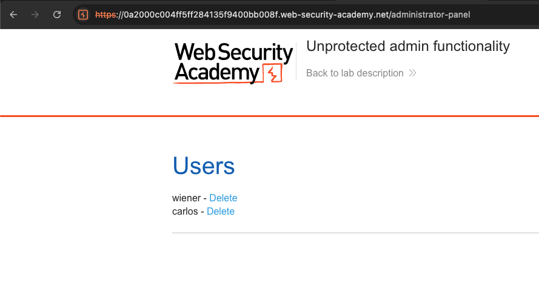
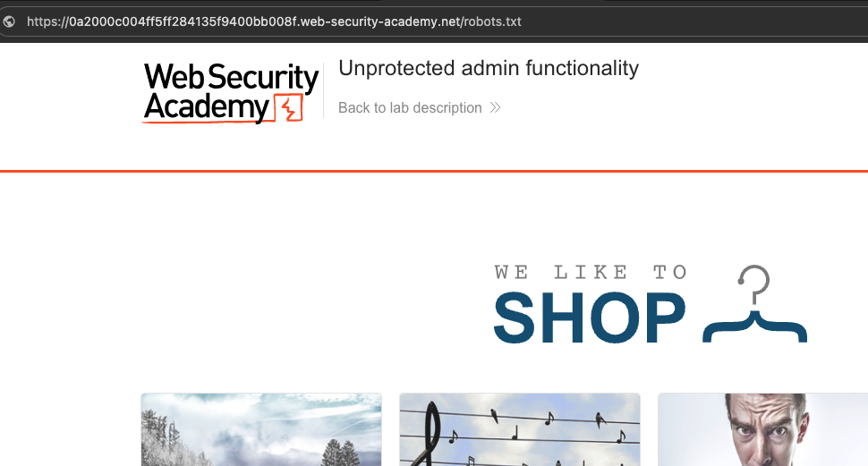
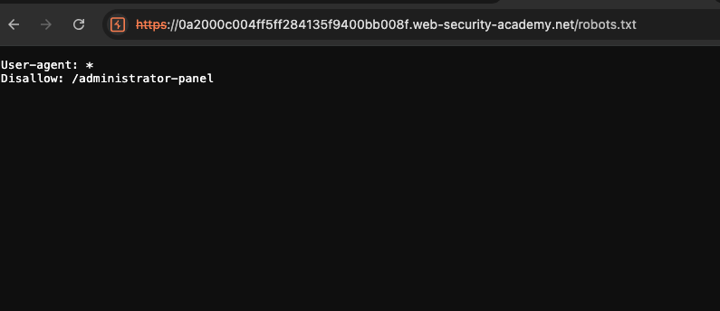
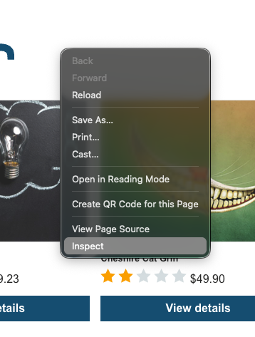
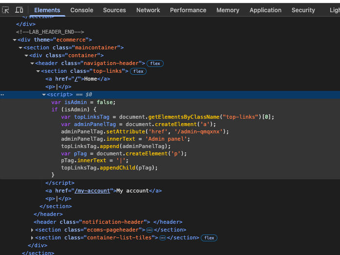
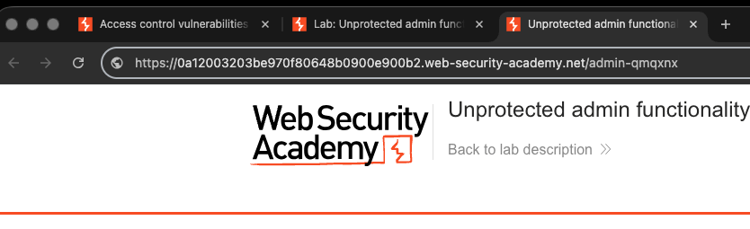
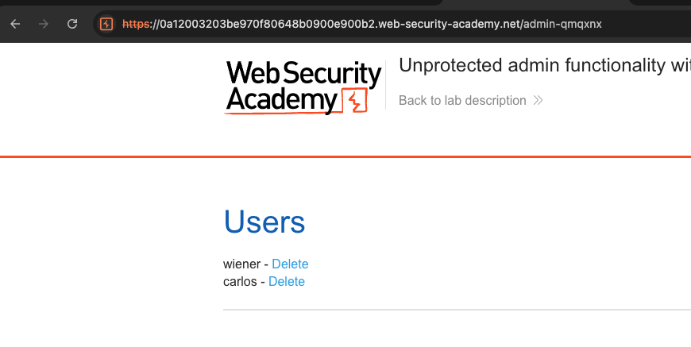

# Broken Access Control — PortSwigger Lab Writeups

## Lab 1: Unprotected Admin Functionality

**Vulnerability:** Unprotected admin panel exposed via robots.txt

**How I found it:**
Navigated to /robots.txt on the lab application. The file revealed a
disallowed path: /administrator-panel. Navigated directly to that URL
without any credentials and gained full admin access.







**What I learned:**
robots.txt is meant to guide search engines, not protect pages.
Developers sometimes accidentally expose sensitive paths in it.
Security through obscurity is not access control.

**The Fix:**
Enforce authentication server-side on every sensitive route.
Never rely on hiding a URL as a security measure. Any path that
requires elevated privileges should verify the user's role on
the server before returning a response.

**OWASP Reference:** A01 - Broken Access Control

---

## Lab 2: Unprotected Admin Functionality with Unpredictable URL

**Vulnerability:** Admin path hidden in client-side HTML source code

**How I found it:**
Right-clicked the page and opened the browser inspect tool. Reviewed
the HTML source and found the admin panel path embedded in a script
tag. Navigated directly to that URL and gained full admin access
without authentication.









**What I learned:**
Anything sent to the browser is visible to the user — no matter
how hidden it seems. Developers cannot rely on obscure URLs in
client-side code as a security control. If it's in the HTML,
an attacker will find it.

**The Fix:**
Never embed sensitive paths or logic in client-side code.
Access control must be enforced on the server side, not hidden
in the front end. Assume all HTML, JavaScript, and client-side
code is readable by anyone.

**OWASP Reference:** A01 - Broken Access Control
```

